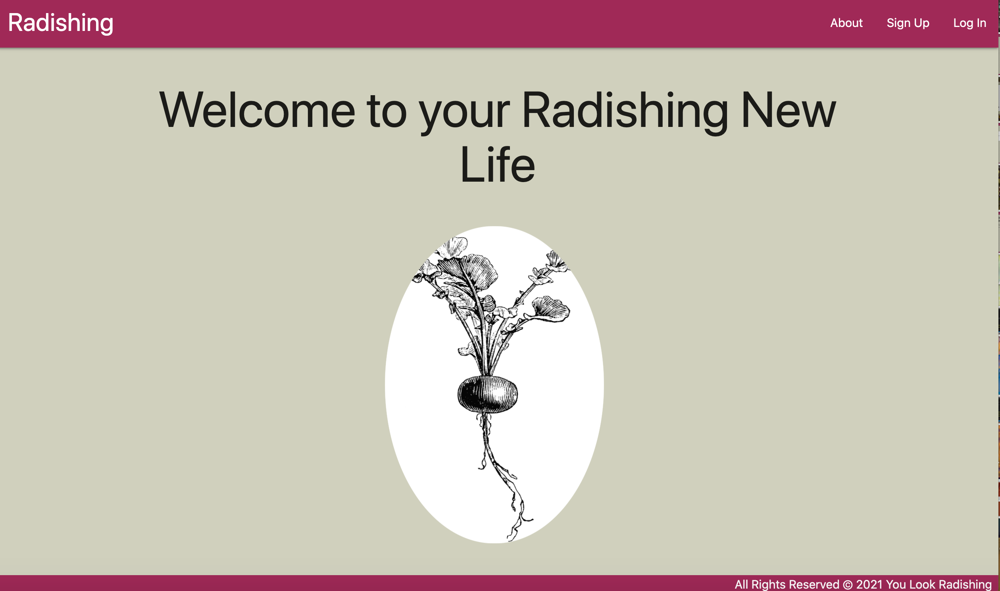
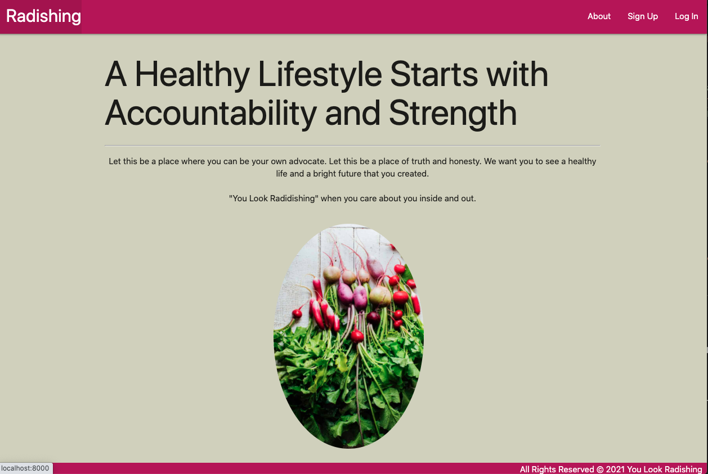
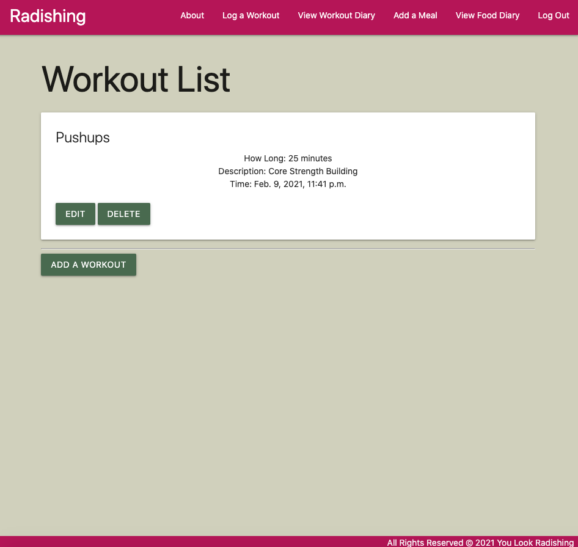
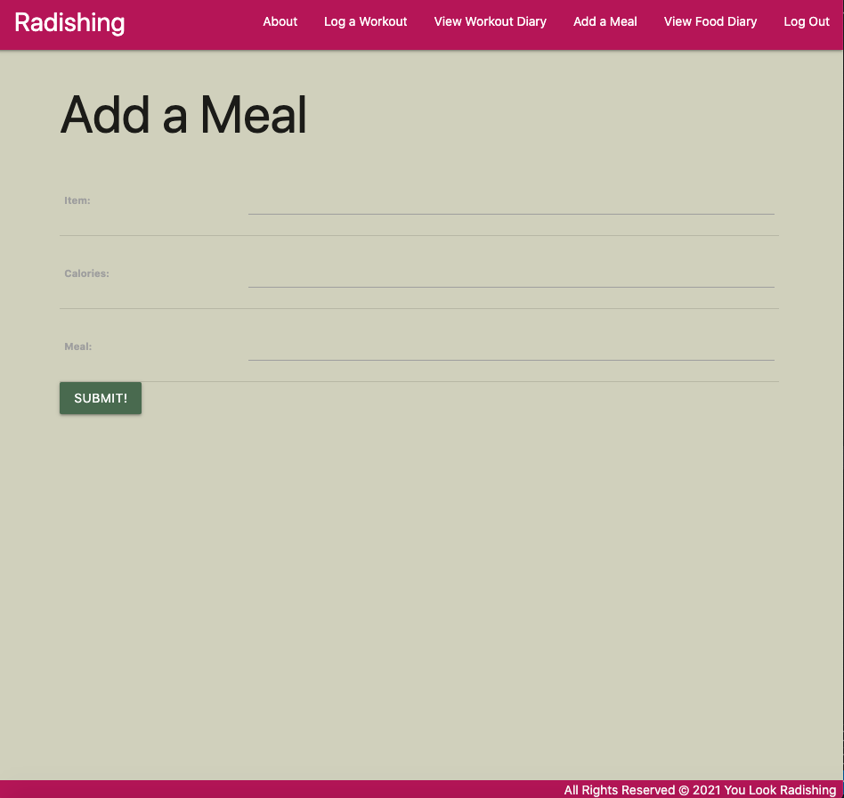

# youlookradishing

This app is a simple diary to track your daily food intake and excercise activities. Though writing down these things will not change what happens in a day, it is helpful to keep a log for accountability. When you write something down and see it in a tangible form, you can see where improvements can be made and/or you can see the progress you've made. 

### Getting Started:

[You Look Radishing!](https://you-look-radishing.herokuapp.com/)

[Trello](https://trello.com/b/vTLzT5Dx/you-look-radishing)

## Screenshots:
### Home Page:

### About Page: 

### Index Pages:

### Add Meal/Workout Page:

## Technologies Used:
* HTML/CSS
* Python
* Django
* Postgresql
* Materialize
* LucidChart
* Trello
* GitHub
* Heroku

## Icebox Features:
I am excited to expand on this project and incorporate AWS to allow users to upload photos to a photo diary. I also want to extend the user model to allow users to update their profiles in a more personalized fashion. 

